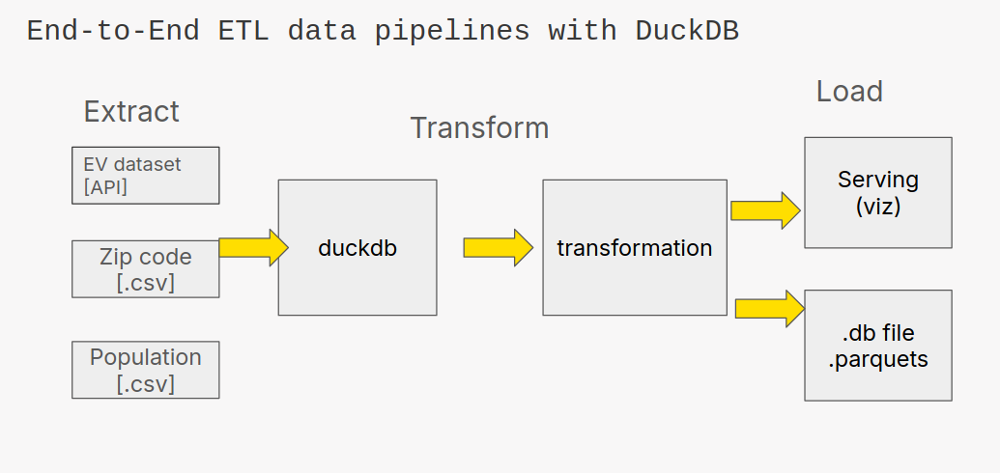
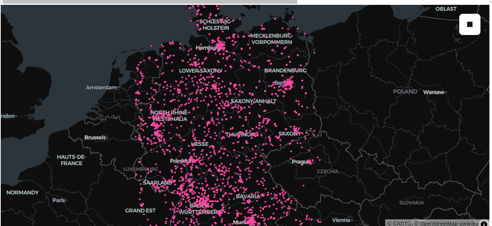
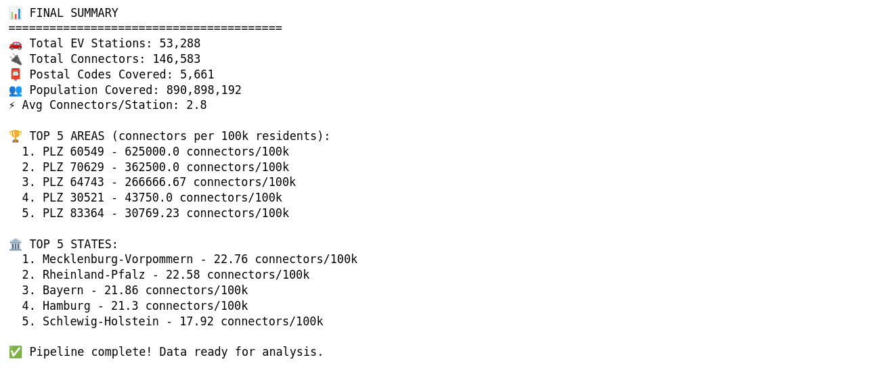

# A simple DuckDB ETL Data Pipeline

This project demonstrates how to build an end-to-end ETL (Extract, Transform, Load) pipeline using (DuckDB)[https://duckdb.org/].

Overview of the pipeline:

# Project Overview

This pipeline integrates multiple datasets, processes them efficiently using DuckDB, and outputs clean, transformed data ready for analytics or machine learning.

Steps:

- Import datasets from multiple sources (APIs, CSVs) - EV dataset, Zip codes, and Population statistics.
- Use DuckDB SQL for efficient data joins, aggregations, and filtering. Handle large datasets locally without a dedicated database server.
- Export cleaned data to Parquet and DuckDB formats.
- Optionally prepare data for visualization dashboards or other pipelines.

# Results

This ETL pipeline processes EV charging station data across Germany and produces insights on station distribution, connector density, and coverage.

## EV Charging Station Distribution

The visualization shows the spatial distribution of EV charging stations across Germany. Each pink dot represents a charging station. High-density clusters appear in urban regions, while rural areas have fewer stations.

## Final summary

Data successfully extracted, transformed, and loaded. Ready for further analytics or integration into machine learning workflows.

